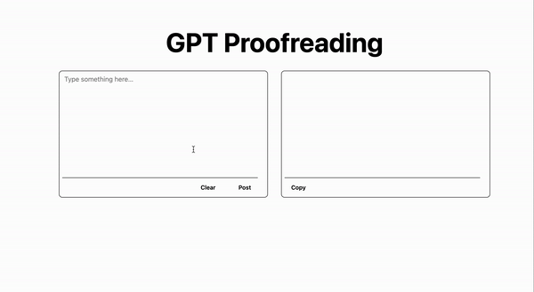

# gpt-proofreading

This is a sample project that uses OpenAI to correct and improve text.

## Demo

## How to use

1. Obtain your openai api key from [here](https://openai.com/)
2. Copy the file named `.env.sample` to `.env.local`.
3. Set the API key obtained from OpenAI to the `NEXT_PUBLIC_OPENAI_API_KEY` variable.
4. Run the command `yarn install` to install the necessary libraries.
5. Run the command `yarn dev`.

## Licence

The scripts and documentation within this project are distributed under the [MIT](./LICENSE) License.
