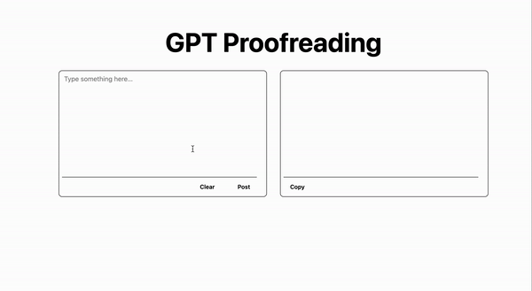

# gpt-proofreading

This is a sample project that uses OpenAI to correct and improve text.

## Demo

## How to use

### client

1. `cd client`

2. Run the command `yarn install` to install necessary libraries.

3. Run the command `NEXT_PUBLIC_API_SERVER=http://localhost:4000 yarn dev` to start the development server.

### server

1. The JavaScript runtime on the server side is using Deno, please install Deno according to your development environment from [here](https://deno.land/).

2. Obtain your OpenAI API key from [here](https://openai.com/).

3. `cd server`

4. Set the environment variable OPENAI_API_KEY with the API key obtained from OpenAI. 
Example: `export OPENAI_API_KEY=xxxxx`

5. Run the command `deno run --allow-net --allow-env server.ts` to start the server.

## Licence

The scripts and documentation within this project are distributed under the [MIT](./LICENSE) License.
